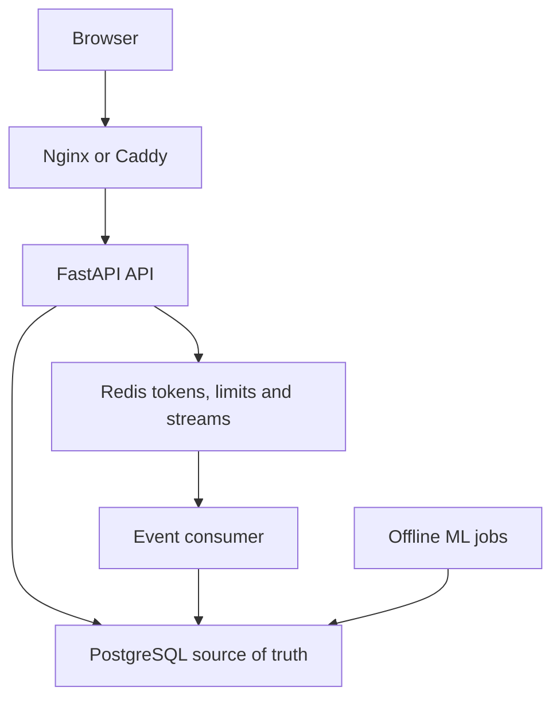

# RetentionOS — Retention Analytics & Experimentation Platform

RetentionOS is a production-style product analytics system that connects behavioral event
ingestion, SQL metrics, churn modeling, experimentation, and operational monitoring in one
reviewable monorepo. It is a portfolio case study for product data science and ML engineering—not
a hosted SaaS product or a claim of production customer usage.

## What this project demonstrates

| Area | Implementation |
|---|---|
| Product analytics | DAU/WAU/MAU, stickiness, ordered funnel, cohort retention, revenue and channel performance |
| Churn ML | Leakage-safe snapshots, temporal validation, calibration, persisted scores, model lineage and explanations |
| Experimentation | Deterministic assignment, exposure logging, SRM checks, confidence intervals, power and decision rules |
| Event reliability | Redis Streams, consumer groups, retries, pending recovery, DLQ and idempotent PostgreSQL persistence |
| Security | Argon2 passwords, short-lived JWTs, rotated HttpOnly refresh cookies, rate limits and ingest-key protection |
| Operations | Health probes, Prometheus metrics, Grafana dashboards, Alertmanager rules and structured logs |
| Delivery | Docker Compose, immutable CI references, security scanning, AWS Terraform and a gated OCI demo path |

The synthetic portfolio dataset is configured for up to 50,000 users and approximately 1.2M
events. Synthetic data provides reproducible channel, churn and treatment effects without exposing
customer information.

## Architecture at a glance



Production requests never retrain the model. Offline jobs create versioned artifacts and persist
user-level churn scores; the API reads those persisted results.

See [system design](docs/architecture/system-design.md), [data model](docs/architecture/data-model.md),
[event pipeline](docs/architecture/event-pipeline.md), and [ML design](docs/architecture/ml-design.md).

## Current delivery status

| Target | Status |
|---|---|
| Local Docker environment | Implemented and smoke-tested |
| GitHub CI and security checks | Passing on pull request #28 |
| AWS architecture | Terraform validated; deployment intentionally gated and not applied |
| OCI portfolio environment | Stack and runbooks complete; live VM pending Singapore A1 capacity |
| Public live URL | Not available yet—do not represent the project as live |

`AWS_DEPLOY_ENABLED=false` remains the intentional safety gate until real Terraform outputs,
DNS, certificates and an approved budget exist.

## Quick start

Requirements: Docker with Compose v2 and Git. Python 3.12 and Node.js 22 are needed only when
running services directly on the host.

```bash
git clone https://github.com/Parmodk2310/retention-analytics-platform.git
cd retention-analytics-platform
cp .env.example .env
# Replace development placeholders before sharing the environment.
docker compose up -d postgres redis
docker compose run --rm backend alembic upgrade head
docker compose up -d backend event-worker frontend
```

Open:

- frontend: <http://localhost:8080>
- OpenAPI UI: <http://localhost:8000/docs>
- liveness: <http://localhost:8000/api/v1/health/live>
- readiness: <http://localhost:8000/api/v1/health/ready>
- metrics: <http://localhost:8000/metrics>

Generate a small local dataset:

```bash
docker compose --profile tools run --rm data-generator python seed.py
docker compose --profile tools run --rm data-generator python validate.py
```

Train and persist churn scores:

```bash
docker compose run --rm backend python -m app.ml.train
docker compose run --rm backend python -m app.jobs.score_churn
```

## Quality gates

```bash
cd backend
pip install -r requirements-dev.txt
ruff check app tests
python -m compileall -q app
pytest -q
bandit -q -r app -x app/ml/artifacts
pip-audit -r requirements.txt
```

```bash
cd frontend
npm ci
npm run lint
npm test
npm run build
```

Pull requests run backend tests, frontend checks, Gitleaks and Trivy. Passing CI does not imply
that cloud infrastructure was created.

## Deployment paths

- [OCI live-demo runbook](infrastructure/oci/README.md): cost-aware single-node ARM64 deployment
  with Caddy HTTPS, currently waiting for Always Free A1 capacity.
- [AWS Terraform](infrastructure/terraform/): reference architecture using ECS Fargate, RDS,
  ElastiCache, ALB, S3 and CloudFront. Review a saved plan before any apply.
- [Terraform security decisions](infrastructure/terraform/SECURITY.md): scanner exceptions and
  compensating controls.

## Documentation

Start with the [documentation index](docs/README.md). Key reviewer paths:

- [Portfolio review guide](docs/portfolio-review.md)
- [API contracts](docs/api-contracts/README.md)
- [Architecture decisions](docs/architecture-decisions/)
- [Operational runbooks](docs/runbooks/)
- [Threat model](docs/security/threat-model.md)
- [Implementation phases](docs/PHASES.md)
- [Repository guide](docs/Project_Guide.md)

## Engineering trade-offs

- PostgreSQL is the source of truth; Redis is an operational accelerator and durable transport.
- Metrics remain SQL-first so definitions and query plans are inspectable.
- Assignment and exposure are separate to prevent never-exposed users from biasing experiments.
- Churn labels use a future observation window to prevent target leakage.
- AWS shows a scalable target; OCI provides a cost-aware demo path.
- Kubernetes is intentionally excluded because it adds operational surface without improving this
  portfolio workload.

## Responsible use

This repository uses synthetic data and is intended for portfolio and reference use. Before using
real customer data, add organization-specific privacy, compliance, backup, incident-response and
data-retention controls.
