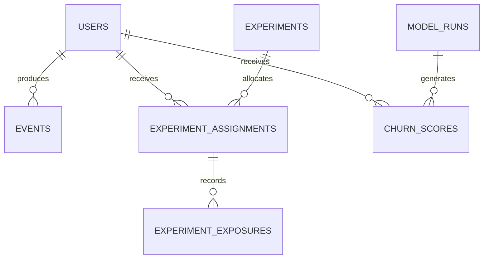

# Data model

PostgreSQL is the authoritative store. Tables are organized around four bounded areas: identity,
behavior, experimentation and ML operations.

| Entity | Purpose | Important invariant |
|---|---|---|
| `accounts` | Dashboard authentication identities | Separate from analytical users |
| `users` | Synthetic product users and acquisition attributes | Stable user identity |
| `events` | Append-only behavioral facts with UTC timestamps and JSONB properties | Unique stable event ID |
| `experiments` | Hypothesis, metric, allocation and lifecycle metadata | Lifecycle transitions are validated |
| `experiment_assignments` | Deterministic user-to-variant mapping | One assignment per experiment/user |
| `experiment_exposures` | Actual treatment exposure | Outcomes are measured after exposure |
| `model_runs` | Immutable model lineage and evaluation metadata | Model version identifies an artifact |
| `churn_scores` | Dated user risk, band and reason codes | Scores link to model lineage |

## Relationships

## Modeling choices

- Accounts and product users are separate because an analyst logging into the dashboard is not a
  customer represented in product metrics.
- Events remain append-only; corrections arrive as new facts rather than silent historical edits.
- JSONB properties allow event-specific attributes while promoted analytical fields remain typed.
- Assignment and exposure are separate so users who never received treatment do not contaminate
  exposure-based estimates.
- Model runs and scores are immutable operational records, enabling lineage and comparison.

## Time and deletion policy

Application timestamps are UTC. Analytics endpoints require bounded windows. The portfolio dataset
is synthetic; a real deployment would additionally require retention schedules, deletion workflows,
data-subject handling and auditable backup policies.

## Integrity

Request validation catches malformed data early, while PostgreSQL constraints provide the final
concurrency-safe defense. Redis is never treated as the system of record.
