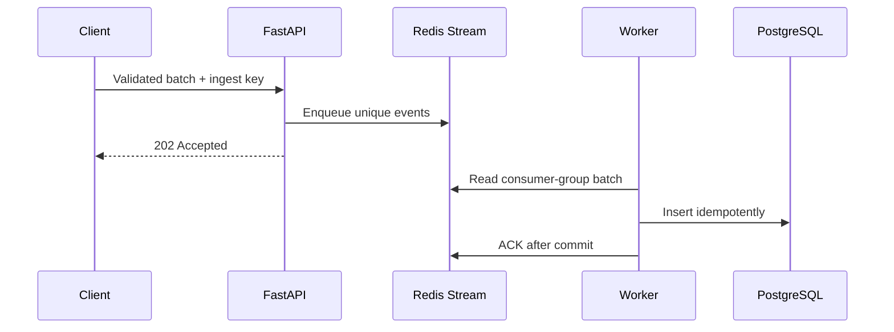

# Event pipeline

## Purpose

The ingestion path separates API latency from database persistence while preserving stable event
identity and observable failure handling.

## Delivery contract

- Transport is at least once, not exactly once.
- Producers create stable event IDs before enqueueing.
- The API removes duplicates within a request.
- PostgreSQL uniqueness is the final defense across retries and concurrent consumers.
- Workers acknowledge only after a successful database commit.
- Failed deliveries remain pending for recovery.
- Messages exceeding the delivery threshold move to a bounded DLQ.

## Backpressure and recovery

The API checks stream backlog before accepting a batch. When the configured limit is reached it
returns HTTP 503 with `Retry-After`; it does not destructively trim the primary stream. Consumers
claim sufficiently idle pending messages, process bounded database batches, and preserve failed
messages for retry or DLQ inspection.

## Observability

The pipeline exports queued, persisted, duplicate, retry, DLQ, backlog, pending, lag, freshness and
persistence-latency signals. Successful commits update a Redis freshness watermark consumed by the
system-health API and alerts.

## Local benchmark

A controlled WSL2/Docker run processed 2,000 events in 2.621 seconds end-to-end (763.06 events/s)
with zero final backlog, pending messages and consumer lag. This is local evidence only—not a cloud
capacity or production SLO.

## Operational response

1. Stop increasing traffic when admission backpressure activates.
2. Check worker availability, backlog, pending count, consumer lag and database latency.
3. Recover idle pending messages before replaying producers.
4. Inspect the DLQ; correct the producer or schema before replay.
5. Confirm the freshness watermark returns within its configured SLA.

Never delete the primary stream or DLQ as a first response.
