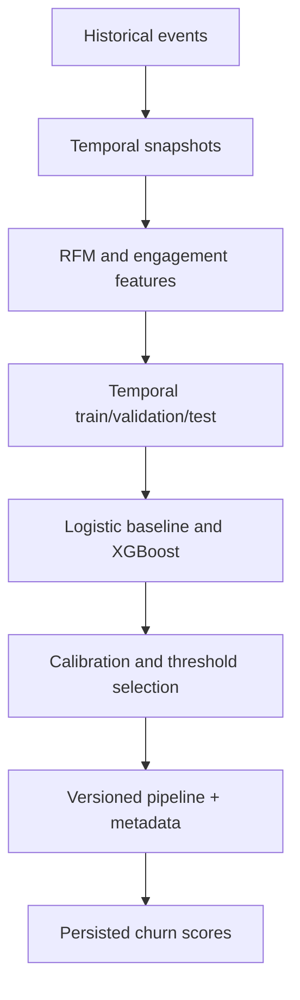

# Churn ML design

## Prediction contract

At snapshot time `T`, features use only observations in `[T-90d, T)`. The label is positive when
no qualifying session or purchase occurs in `[T, T+30d)`. This temporal boundary prevents future
activity from leaking into training features.

## Pipeline

Categorical preprocessing ships inside the scikit-learn pipeline, preventing training/serving
encoding skew. The CPU-only XGBoost distribution keeps ARM64 images smaller and avoids unused GPU
libraries.

## Evaluation

PR-AUC is the primary ranking metric because churn is imbalanced. ROC-AUC, precision, recall, F1,
Brier score, Lift@10%, calibration and threshold behavior remain visible for business review.
Temporal validation is preferred over random cross-validation.

Thresholds are decisions, not universal model properties. Selection must state the intervention
capacity and relative cost of false positives and false negatives.

## Serving model

Training and batch scoring are offline jobs. A scoring run persists model version, probability,
risk band and explanation information to PostgreSQL. Dashboard APIs read persisted scores through
`/api/v1/churn/*`; they do not retrain or require synchronous XGBoost inference.

The legacy `/api/v1/ml/churn/*` contract is not an active inference path.

## Monitoring

Model health exposes lineage, evaluation metrics, dataset/split metadata, calibration, risk-band
configuration, label drift and global feature importance when available. Production monitoring
would add scheduled data-quality checks, outcome-delay handling, segment performance, alert
ownership and a documented rollback threshold.

## Limitations

- Results are learned from synthetic data and do not establish real-world commercial lift.
- Feature importance and SHAP values explain model behavior, not causal effects.
- Retraining frequency must be chosen after observing real data latency and drift.
- Fairness and privacy review must be repeated before using customer data.
