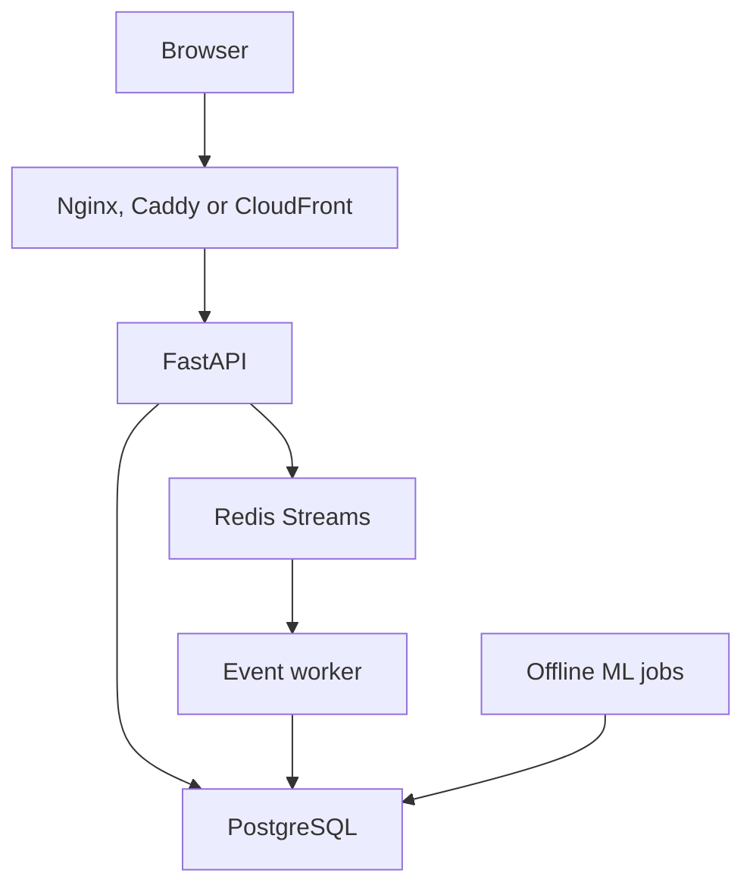

# System design

## Goals

RetentionOS combines product analytics, churn operations and experimentation without hiding
business logic inside dashboard code. The system favors reproducibility, explicit contracts and
operational visibility over maximum infrastructure complexity.

## Runtime components

| Component | Responsibility | State |
|---|---|---|
| React SPA | Analyst workflows and visualizations | Stateless |
| FastAPI | Authentication, validation and domain APIs | Stateless |
| PostgreSQL | Accounts, behavioral facts, experiments, model runs and churn scores | Durable source of truth |
| Redis | Token revocation, rate limits, cache and event transport | Operational state |
| Event worker | Redis Streams consumption and idempotent persistence | Stateless consumer |
| Offline jobs | Data generation, training, scoring and aggregate refresh | Ephemeral |
| Prometheus/Grafana | Metrics, dashboards and alert evaluation | Optional local operations stack |

## Request and event paths

Analytics queries read PostgreSQL directly. Event ingestion acknowledges queue acceptance with HTTP
202; persistence happens asynchronously. Churn training and scoring run outside web requests.

## Deployment views

### Local and OCI demo

Docker Compose runs six production services on one ARM64-capable host. Only Caddy publishes ports.
This is cost-aware and reproducible, but it is not highly available.

### AWS reference architecture

CloudFront serves a private S3 SPA and routes `/api/*` to an HTTPS ALB. ECS Fargate runs the API
and event worker; RDS and ElastiCache occupy data subnets. ECR stores images, Secrets Manager
provides application secrets, CloudWatch carries service telemetry, and EventBridge can start
scheduled tasks.

The Terraform is validated but intentionally unapplied. AWS deployment remains gated until budget,
DNS, certificates and generated outputs exist.

## Reliability boundaries

- Liveness proves the API process responds; readiness checks PostgreSQL and Redis.
- Stable event IDs plus a database uniqueness constraint make retries safe.
- Messages are acknowledged only after persistence.
- Poison messages move to a bounded DLQ after the delivery threshold.
- Backpressure rejects new batches with HTTP 503 before unbounded queue growth.
- Persisted churn scores isolate dashboard latency from model runtime.

## Scaling path

For a real production workload: run API and worker replicas across availability zones, add
autoscaling, use Multi-AZ PostgreSQL, deploy Redis failover, introduce tested backup restoration,
place compute in private subnets, and add WAF and organization-specific compliance controls.

## Explicit non-goals

- Kubernetes orchestration for the portfolio workload.
- Online model training or per-request model retraining.
- Real customer PII.
- A claim that the current OCI or AWS design is already a live multi-region service.
