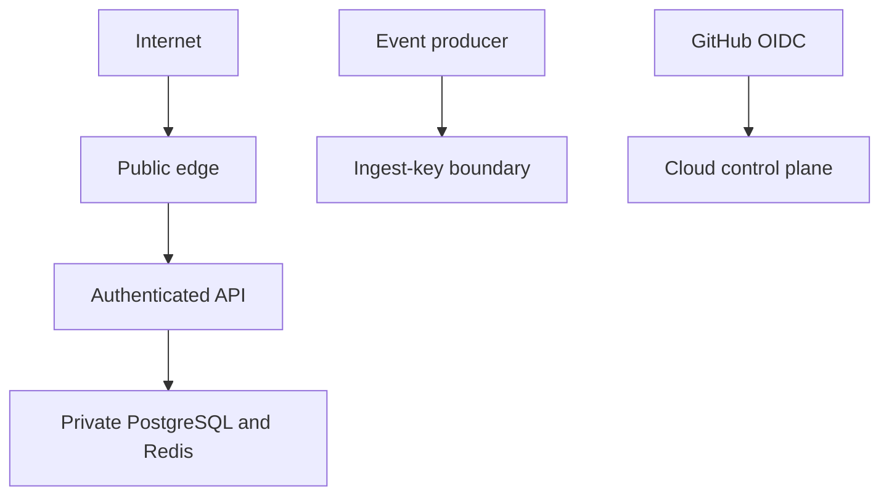

# Threat model

## Scope and assumptions

This model covers the dashboard, API, event ingestion, PostgreSQL, Redis, ML artifacts, CI/CD and
cloud deployment paths. The portfolio environment uses synthetic data. Internet clients, event
producers and compromised credentials are treated as untrusted.

## Assets

- dashboard accounts, access tokens and refresh tokens;
- behavioral and experiment-integrity data;
- PostgreSQL and Redis availability;
- model artifacts, metadata and persisted scores;
- source control, CI identity and cloud credentials;
- deployment availability and cost controls.

## Trust boundaries

## Threats and controls

| Threat | Existing control | Residual risk / next control |
|---|---|---|
| Credential theft | Argon2, short access tokens, HttpOnly refresh cookie, Redis revocation | Add MFA/SSO for real users |
| Brute-force login | Per-route rate limits and generic authentication errors | Add edge reputation controls at scale |
| Token replay | Refresh rotation and fingerprint revocation | Access tokens remain valid until short expiry |
| Event forgery or flood | Ingest key, allowlists, size bounds, rate limit and backlog admission control | Rotate producer keys and add per-producer identity |
| Injection | Pydantic validation and parameterized SQL | Continue query review and negative tests |
| Duplicate event effects | Stable event ID and database uniqueness | At-least-once clients must tolerate duplicates |
| Data exfiltration | Private data services, no public Compose ports, least-privilege IAM | Add audited access and egress policy for real data |
| Supply-chain compromise | Lock files, immutable action/image references, Gitleaks and Trivy | Add signed artifacts/SBOM enforcement |
| Cloud credential leakage | GitHub OIDC and secret stores; no permanent deploy key in GitHub | Rotate local operator keys and review trust policies |
| Cost abuse | Deployment gates, bootstrap desired count zero, free-shape checks | Add billing alarms and quotas before apply |
| Model misuse | Offline training, persisted lineage and health metadata | Add approval, fairness and rollback policy |
| Availability loss | Health probes, restarts, metrics, retries and DLQ | Single-node OCI demo is not highly available |

## Security invariants

- Never commit `.env`, `.env.production`, cloud keys, database passwords or customer PII.
- Only the public gateway publishes ports in the production Compose deployment.
- PostgreSQL remains authoritative; Redis loss must not corrupt business records.
- CI success cannot bypass the explicit production deployment gate.
- Scanner suppressions require a documented justification and compensating control.

## Incident priorities

1. Contain exposed credentials or public data access.
2. Disable affected deployment identities and rotate secrets.
3. Preserve logs, request IDs, revisions and timelines without copying sensitive payloads.
4. Restore from a known-good revision or backup.
5. Document root cause, control gaps and follow-up ownership.

Before processing real customer data, perform an organization-specific privacy, compliance,
retention, backup-restoration and incident-response review.
